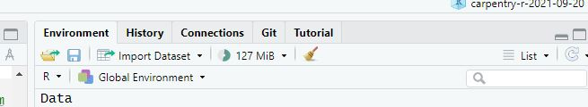

```{r setup, include=FALSE}
knitr::opts_chunk$set(echo = TRUE)
```


## Data Frames and Subsetting  

Part 2 of the workshop. Start at 'Realsitic Example' <https://swcarpentry.github.io/r-novice-gapminder/05-data-structures-part2/index.html#realistic-example>

We are going to use the datafile that you downloaded into your project data folder.

###There are at least three different ways to read in data:


1) read the file from your data folder

```{r}
gapminder <- read.csv("data/gapminder_data.csv", stringsAsFactors = TRUE)
```

2) download the file in-code and then read in
```{r}
download.file("https://raw.githubusercontent.com/swcarpentry/r-novice-gapminder/main/data/gapminder_data.csv", destfile = "data/gapminder_data.csv")

gapminder <- read.csv("data/gapminder_data.csv", stringsAsFactors = TRUE)
```

3) read directly from the internet
```{r}
gapminder <- read.csv("https://raw.githubusercontent.com/swcarpentry/r-novice-gapminder/main/data/gapminder_data.csv", stringsAsFactors = TRUE)
```


Lasty, if you have a file type you're not sure about (SAS, SPSS, etc) you can use the 'Import Dataset'from the RStudio interface.



## Examine your dataset using the str() and summary() functions

**str()** or allows you to get a compact look at the layout or *structure* of your dataset 

```{r}
str(gapminder)

```
 
  
**summary(*object*) is another way to examine your dataset. It gives you numeric, tabular, or descriptive summary of each column. 

```{r}
summary(gapminder)
```


You can also summarize a column: 

```{r}
summary(gapminder$country)
```

### Other functions you can use to examine data: 
(demo) 
typeof(object$colum) 
   
Use **str()** on a colum:   **str(country$year)**   

We can also interrogate the data frame for information about its dimensions; remembering that str(gapminder) said there were 1704 observations of 6 variables in gapminder, what do you think the following will produce, and why?

```{r}
length(gapminder)  
```

### Get the number of Rows and Columns  

**nrow(gapminder)** 

**ncol(gapminder)**  

**dim(gapminder)**    to get both rows and colums   


###  Display the beginning or end of a dataset  

Recall from the shell lesson the head() and tail() functions   

head(gapminder)  

tail(gapminder)  


##  Subsetting your data  

